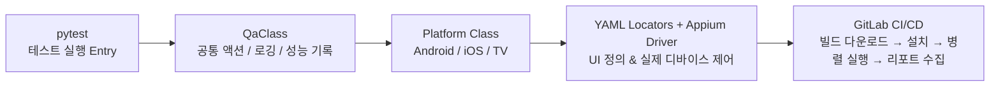

# 📱 Mobile UI Automation Framework
운영 환경에서 실제 검증 가능한 **End-to-End UI 자동화 + CI/CD 병렬 테스트 + 성능 로그 수집**을 포함한  
**실전 자동화 아키텍처 구축 사례**

---

## ⚙ Automation Flow


> **병렬 실행 및 성능 기반 품질 게이트 자동화를 통해 운영 안정성과 배포 속도 개선**

---

## 🧱 구성 요소 상세 (File Responsibility)

<details>
<summary><b>📦 클릭하여 상세 보기</b></summary>

| 파일 | 역할 |
|-------|-------|
| `QaClass.py` | UI 제어 / 공통 로직 / 성능 기록 / 디바이스 제어 |
| `AndroidClass.py` | 로그인 → 검색 → 방송참여 → 팝업/배너 처리 등 시나리오 조립 |
| `Android_live_test.py` | Live 사용자 기능 검증 (채팅 / 화질 / 모드 / 종료) |
| `Android_elements.yaml` | UI Locator 정의 (id → aid → xpath 계층 관리) |
| `apk_gitlab_install.py` | GitLab Artifact → APK 자동 설치 및 실행 |
| `.gitlab-ci.yml` | OS/기기별 병렬 pytest 실행 파이프라인 |

> Common + Platform + Scenario 구조 적용으로 유지보수 비용 절감 & 빠른 기능 확장 가능

</details>

---

## 🧠 Architecture Summary (2-Column Optional Layout)

<div style="display:flex; gap:24px;">
<div style="flex:1">

### 📘 핵심 설계 개념
- UI와 테스트 코드 완전 분리(YAML 기반)
- 플랫폼 클래스 계층 구조로 확장성 강화
- CI/CD 자동 실행 + 아티팩트 리포트 수집
- Cold Start/실환경 기반 테스트 설계

</div>
<div style="flex:1">

```mermaid
flowchart LR
    A[pytest] --> B[QaClass]
    B --> C[Platform Class]
    C --> D[YAML + Appium]
    D --> E[GitLab CI/CD]
