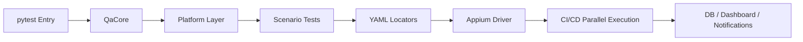

# 📱 Mobile UI Automation Framework
실제 기기 기반 End-to-End UI 자동화 + 성능 데이터 수집 + 병렬 CI/CD 실행을 위한 테스트 엔진 구조

---

## 🔧 Framework Architecture


## 🧱 Framework 구조
| Layer               | 역할                                        | 핵심 포인트       |
| ------------------- | ----------------------------------------- | ------------ |
| **QaCore**          | 공통 액션 / 스크롤 / 성능 수집 / DB Insert / Restart | 테스트 코드 단순화   |
| **Platform Layer**  | 화면 이동 & 사용자 흐름 조립                         | UI/플랫폼 분리    |
| **Scenario Tests**  | 기능 단위 테스트 모듈                              | 독립 실행 가능 구조  |
| **YAML Locator**    | UI 식별자 외부화                                | UI 변경 영향 최소화 |
| **ADB/DB/Firebase** | 성능 수집 / 데이터 검증                            | 데이터 기반 검증    |
| **CI/CD Runner**    | APK 다운로드 → 설치 → 병렬 실행                     | 운영 품질 게이트    |

## 1. 핵심 코드 설계

이 프레임워크의 핵심은 **공통 액션 함수(QaClass) → 플랫폼 클래스(AndroidClass) → 시나리오 테스트(pytest)** 로 이어지는 계층 구조입니다.  
테스트 코드는 “무엇을 검증할지”만 표현하고, 실제 UI 제어와 성능 기록은 공통 레이어가 처리합니다.

---

### 1) 공통 액션 함수 (QaClass)

> 테스트 코드에서는 UI 동작을 직접 작성하지 않고,  
> **`element_action()` 하나로 클릭 / 입력 / 체크 / 텍스트 조회를 처리**합니다.

<details>
<summary>코드 보기</summary>

```python
class QaClass:
    def __init__(self, run_os, job_id, db, driver, elements, udid, debug_yn, account):
        self.run_os = run_os
        self.job_id = job_id
        self.db = db
        self.driver = driver
        self.elements = elements
        self.udid = udid
        self.debug_yn = debug_yn
        device_info = common.adb.get_device_info(udid)
        self.os_version = device_info["os_version"]
        self.model = device_info["model"]
        self.account = account

    def element_action(
        self,
        id: str = "",
        find: Literal["id", "xpath", "icc", "aid", "image"] = "",
        action: Literal[
            "get_text",
            "get_location",
            "input",
            "check",
            "click",
            "long_tap",
            "get_attribute",
            "x_offset_click",
            "y_offset_click",
        ] = "",
        value: str = "",
        index: int = 0,
        offset: int = 0,
        assertion: bool = True,
        timeout: int = 40,
        image_path: str = "",
        accuracy: float = 0.5,
    ):
        """모든 UI 동작을 단일 함수로 추상화"""
        result = common.appium.element_action(
            driver=self.driver,
            elements=self.elements,
            id=id,
            find=find,
            action=action,
            value=value,
            index=index,
            offset=offset,
            timeout=timeout,
            image_path=image_path,
            accuracy=accuracy,
        )
        if assertion:
            assert result
        return result

    def insert_performance_report(self, test_name: str):
        """테스트 단위 성능 데이터(DB) 기록"""
        res = common.adb.get_device_resource_info(self.udid)
        common.database.insert_performance_report(
            db=self.db,
            test_run_time=self.test_run_time,
            job_id=self.job_id,
            test_name=test_name,
            os=self.run_os,
            os_version=self.os_version,
            model=self.model,
            cpu_usage=res["cpu_usage"],
            memory_usage=res["memory_usage"],
            cpu_temperature=res["cpu_temperature"],
            battery_temperature=res["battery_temperature"],
        )
```

</details>

**포인트**
- 진입 플로우는 base_test()로 한 번만 정의 → 시나리오 별 중복 제거
- 실제 테스트 함수는 **무슨 기능을 어디까지 검증하는지**만 잘 보이게 작성
- 마지막에 insert_performance_report() 호출로 기능 단위 성능 데이터 자동 축적
